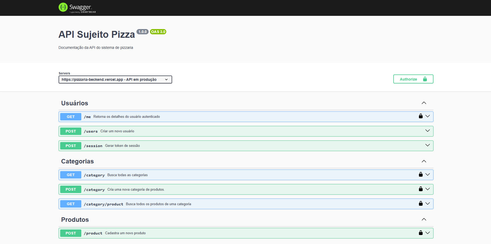

<div style="display: flex; flex-direction: column; text-align: center;">
    <h1>DevPizza - Backend</h1>
    
</div>

## Sumário

- [\[pizzaria-backend\]](#)
  - [Sumário](#sumário)
  - [Introdução](#Introdução)
  - [Descrição Geral](#descrição-geral)
  - [Tecnologias Usadas](#tecnologias-usadas)
  - [Princípais funcionalidades](#princípais-funcionalidades)
  - [Pré Requisitos](#pré-requisitos)
  - [Como Executar o Projeto](#como-executar-o-projeto)
  - [Links Úteis](#links-úteis)
  - [Contato](#contato)

## Introdução

Este repositório contém o backend do projeto [**DevPizza**](https://github.com/vgab1/devpizza-frontend), um sistema de atendimento para pizzarias. O backend é responsável por gerenciar pedidos, produtos e a comunicação entre a cozinha (web) e os garçons (mobile). O frontend (web e mobile) está separado em outros repositórios.

## Descrição Geral

O **DevPizza** é um sistema completo para pizzarias, onde:
- **Garçons** usam um aplicativo mobile para realizar pedidos e gerenciar atendimentos.
- **Cozinha** usa uma interface web para visualizar e preparar os pedidos.
- **Backend** gerencia toda a lógica de negócios, incluindo pedidos, produtos, autenticação e integração com serviços externos (como Cloudinary para upload de imagens).

Este repositório é dedicado ao backend, desenvolvido em **Node.js com TypeScript** e hospedado na **Vercel**.

---

## Tecnologias Usadas

&nbsp;


- **Linguagem**: TypeScript
- **Framework**: Express
- **Banco de Dados**: PostgreSQL (hospedado no Neon)
- **ORM**: Prisma
- **Autenticação**: JSON Web Token (JWT) e Bcrypt
- **Upload de Imagens**: Multer e Express-fileupload (hospedadas no Cloudinary)
- **Documentação**: Swagger (UI e JSDoc)
- **Ferramentas de Desenvolvimento**:
  - ts-node-dev (execução em desenvolvimento)
  - Cors (para permitir requisições de diferentes origens)
  - Dotenv (gerenciamento de variáveis de ambiente)

---

## Princípais funcionalidades

### 1. **Pedidos**
- **Criar pedidos em rascunho**: Os garçons podem iniciar pedidos e adicionar itens antes de enviar para a cozinha.
- **Adicionar itens ao pedido**: Cada pedido pode conter vários produtos (pizzas, bebidas, etc.).
- **Enviar para a cozinha**: Quando o pedido estiver pronto, ele é enviado para a cozinha para preparo.
- **Finalizar pedido**: Após o preparo, a cozinha pode finalizar o pedido.

### 2. **Autenticação**
- Autenticação de usuários (garçons e cozinha) usando JWT.
- Proteção de rotas com middleware de autenticação.

### 3. **Upload de Imagens**
- Upload de imagens de produtos usando Multer e Express-fileupload.
- Hospedagem das imagens no Cloudinary.

### 4. **Documentação da API**
- Documentação completa da API usando Swagger.
- Acessível em: [https://pizzaria-beckend.vercel.app/api-docs](https://pizzaria-beckend.vercel.app/api-docs)

---

## Como Executar o Projeto

### Pré-requisitos
- Node.js (v18 ou superior)
- PostgreSQL (ou use o Neon para um banco de dados em nuvem)
- Conta no Cloudinary (para upload de imagens)

### Passos para Executar

1. **Clone o repositório**:
    ```bash
    git clone https://github.com/vgab1/devpizza-backend.git
    cd pizzaria-backend
    ```

2. **Instale as dependências**:
    ```bash
    yarn install
    ```

3. **Instale as dependências**:
    ```bash
    DATABASE_URL="sua_url_do_postgres"
    JWT_SECRET="sua_chave_secreta_jwt"
    PORT="sua_porta_local"
    CLOUDINARY_CLOUD_NAME="seu_cloud_name"
    CLOUDINARY_API_KEY="sua_api_key"
    CLOUDINARY_API_SECRET="sua_api_secret"
    ```

4. **Execute as migrations do Prisma**:
    ```bash
    yarn prisma migrate dev
    ```

5. Execute o projeto
    - Para desenvolvimento:
        ```bash
        yarn dev
        ```
    - Para Para produção:
        ```bash
        yarn build
        yarn start
        ```

6. **Acesse a documentação**:
- Localmente: http://localhost:3333/api-docs (mude para a porta local que definir)
- Em produção: https://pizzaria-beckend.vercel.app/api-docs (ou o ulr da sua API hospedada)

## Links Úteis

- Documentação da API: [https://pizzaria-beckend.vercel.app/api-docs](https://pizzaria-beckend.vercel.app/api-docs)
- Endpoint da API: [https://pizzaria-beckend.vercel.app](https://pizzaria-beckend.vercel.app)
- Repositório do Frontend Web: [https://github.com/vgab1/devpizza-frontend](https://github.com/vgab1/devpizza-frontend)
- Repositório do Mobile: [https://github.com/vgab1/devpizza-mobile](https://github.com/vgab1/devpizza-mobile)

## Contato

Para obter mais informações, entre em contato comigo em:

- Email: dev.vgab1@gmail.com
- GitHub: https://github.com/vgab1
